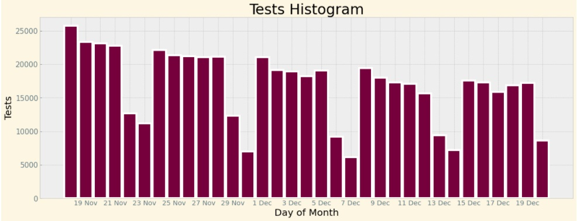
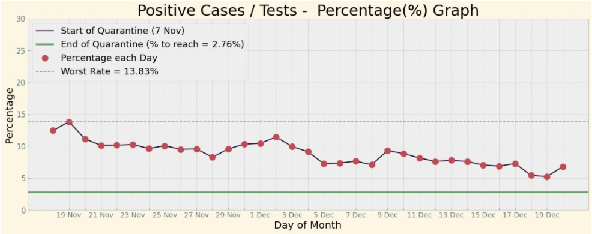
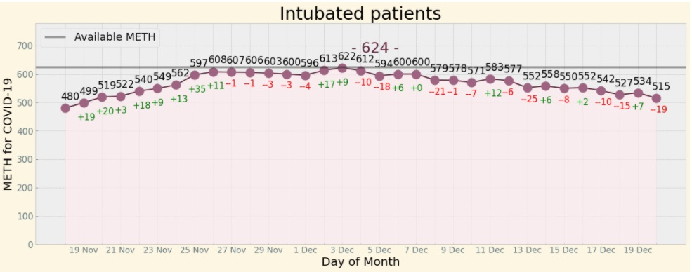

# Covid-19 Greece

### **This is a visual representation of the pandemic in Greece.** 
Data have been hardcoded on the script and they are available on the daily covid-19 records, 
shared by Hellenic National Public Health Organization [(EODY)](https://eody.gov.gr/) and they can be found [here](https://eody.gov.gr/epidimiologika-statistika-dedomena/ektheseis-covid-19/).

#
Data are saved into lists starting from 1st November till 20 December, while the User has the option  
to adjust their starting point **(the "from" part)**.

